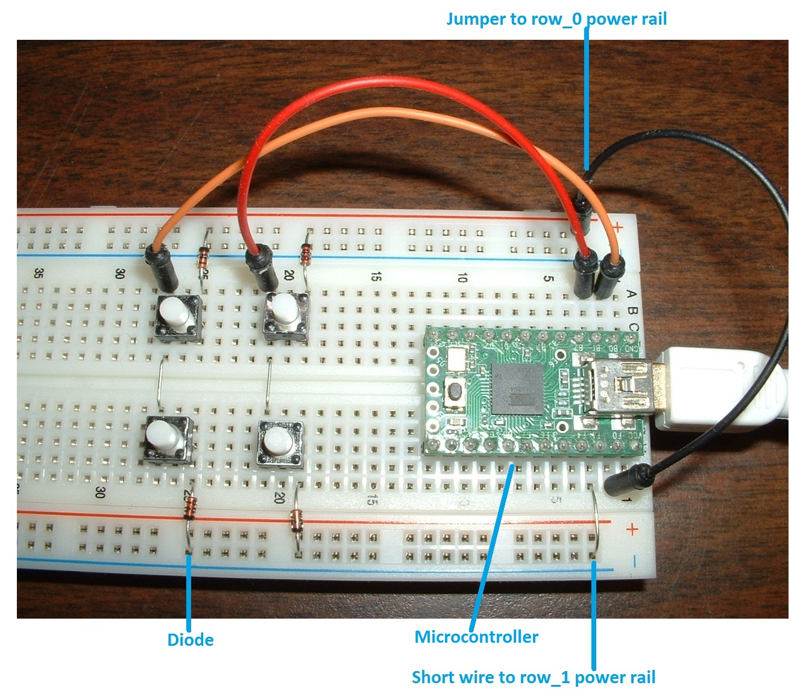
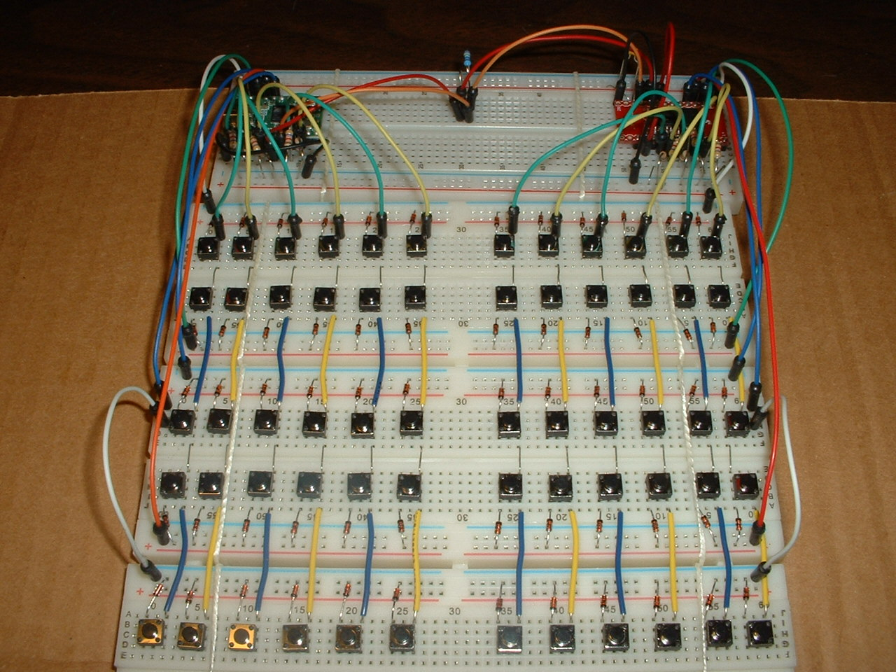

Tutorial 1 - breadboard keyboard
================================
When you finish this tutorial you will have a working keyboard and understand how a key matrix works.

## Why a breadboard keyboard is useful
All the tutorial example sketches run on breadboard keyboards that have 2 to 8 keys.
Breadboard keyboards have row-column matrices and diodes just like the big keyboards.

A breadboard is the easiest way to learn keyboard electronics.
A novice won't get everything right the first time.
It's easy to get some detail wrong with electronics.
There is a learning curve.
Compared to PCBs, breadboard keyboards are easier to learn on because:
* Mistakes are easily corrected; no soldering and desoldering
* Parts can be reused in many different configurations
* A small keyboard is easier to trouble shoot

Breadboard keyboards are useful for:
* learning keyboard electronics - diodes, micro controllers, I/O expanders
* learning the firmware development workflow
* prototyping circuits before making a PCB

## Breadboard keyboard starter kit
The parts needed to build all the tutorial Breadboard Keyboards are listed in [breadboard_keyboard_supplies.ods](breadboard_keyboard_supplies.ods).

You will need two tools:
* Wire cutters (or nail clipper)
* A multi-meter for trouble shooting

## How a breadboard works
To understand the breadboard keyboard you will need to know the internal parts of a breadboard:
* bus strip
* terminal strip

These are explained in [How to Use a Breadboard](https://learn.sparkfun.com/tutorials/how-to-use-a-breadboard)

## How a keyboard matrix works
This excellent article explains how the microcontroller, matrix, switches and diodes work together:
[How a Key Matrix Work](http://pcbheaven.com/wikipages/How_Key_Matrices_Works/)

## Building a basic breadboard keyboard
The basic breadboard has 4 switches and a microcontroller.

The key matrix has two rows and two columns.
Breadboard bus strips are used as matrix rows.
Short bare wires connect terminal strips into matrix columns.
Switch-diode pairs connect rows to columns.

The green rectangle on the right is the Teensy 2.0 microcontroller.
The matrix rows and columns connect to the microcontroller via jumper wires.

Tutorials 4,5,9 will add more components to the breadboard.
Positioning components as shown on the picture will provide space for those components, with room for up to 9 cols.
Breadboard terminal strips are indexed 1 to 63 for accurate positioning of components.
    [pic of IOE, LEDs, active high on one bb]

Breadboard keyboard assembly instructions:

1. Cut leads to length.
 * tactile-switch-lead length 6 to 8 mm
 * diodes 22 to 24 mm total end-to-end length, and save the cut offs for steps 2 and 3
2. Insert parts into the breadboard as shown in the picture.
 * Teensy LC on the terminal strip labeled 1
 * switch leads oriented so that they will connect diodes to columns
 * diode cut offs connect terminal strips into columns
 * diodes are orient with cathode (banded end) towards the row (bus strip)
3. Insert jumper wires connecting Teensy2 to the matrix rows and columns.
 * follow pin connections table (below) and consult pinout diagram in
   [close-up pic shows switch way half out, to show lead orientation]
   [Teensy2_pinout.txt](../doc/Teensy2_pinout.txt)

todo add a schematic

<!-- This schematic was written by consulting the micro-controller's datasheet and using the ?? tool.

this table might not match the sketches, replace with a schematic

**Teensy 2.0 pin connections table**

| Pin number | Row  Column |
|------------|-------------|
| 21         | row_0       |
| 20         | row_1       |
| 0          | col_0       |
| 1          | col_1       |
-->

## Compiling and loading the keyboard firmware
Follow the [keybrd Library User's Guide](../doc/keybrd_library_user_guide.md) to set up the Arduino environment and to compile and load keybrd firmware onto the keyboard's controller.

## Bigger breadboard keyboards
Sometimes its useful to prototype a full keyboard matrix before designing the PCB.
Several breadboards can be tied together into one.

 keybrd tutorial by <a xmlns:cc="http://creativecommons.org/ns#" href="https://github.com/wolfv6/keybrd" property="cc:attributionName" rel="cc:attributionURL">Wolfram Volpi</a> is licensed under a <a rel="license" href="http://creativecommons.org/licenses/by/4.0/">Creative Commons Attribution 4.0 International License</a>. Permissions beyond the scope of this license may be available at <a xmlns:cc="http://creativecommons.org/ns#" href="https://github.com/wolfv6/keybrd/issues/new" rel="cc:morePermissions">https://github.com/wolfv6/keybrd/issues/new</a>.
