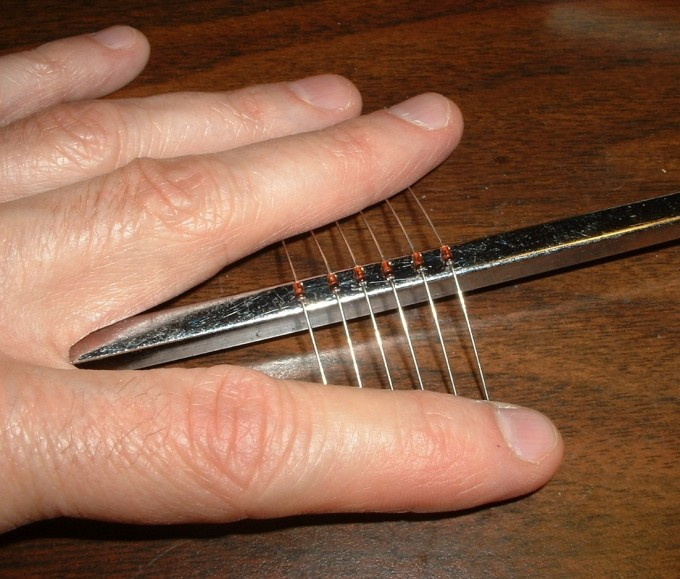
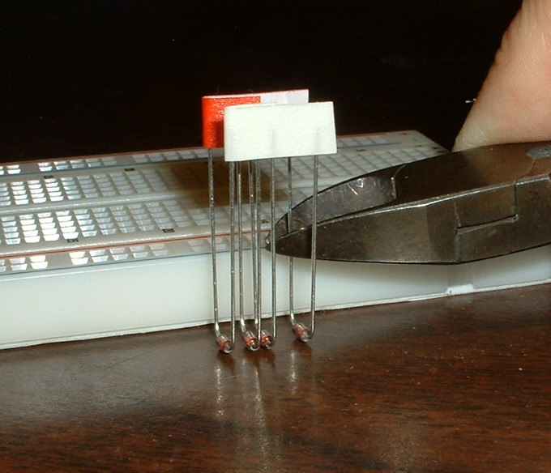
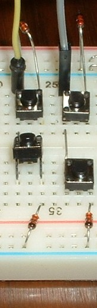
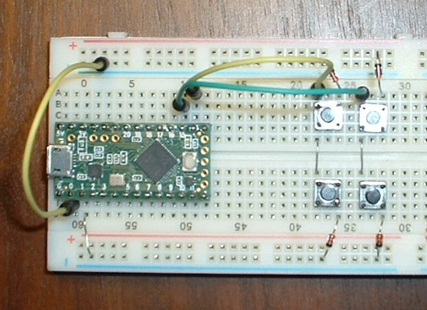

Tutorial 1 - breadboard keyboard
================================
In this tutorial, you will build a breadboard keyboard with 4 keys.
The keyboad will be used in tutorials 2 through 7.

When you finish this tutorial you will have a working keyboard and understand how a key matrix works.

## Why a solderless breadboard keyboard is useful
Breadboard keyboards have row-column matrices and diodes just like the big keyboards.

A breadboard is the easiest way to learn keyboard electronics.
A novice won't get everything right the first time.
Learning is fun when mistakes are easily corrected.
Compared to PCBs, breadboard keyboards make learning faster because:
* Mistakes are easily corrected; no soldering and desoldering
* Parts can be reused in many different configurations
* A small keyboard is easier to trouble shoot

Breadboard keyboards are useful for:
* learning keyboard electronics - micro controllers, diodes, shift registers, I/O expanders
* learning the firmware development workflow
* prototyping circuits before making a PCB

Arduino simulation software might be another way; I haven't tried that.

## Breadboard keyboard starter kit
The parts needed to build the tutorial Breadboard Keyboards are listed in [breadboard_keyboard_supplies.ods](breadboard_keyboard_supplies.ods).

The tutorials use a Teensy LC controller, but any Arduino-compatible controller should work.

You will need two tools:
* Wire cutters (or nail clipper)
* A multi-meter for trouble shooting

Wire striper and lead forming tool are optional.

## How a breadboard works
To understand the breadboard keyboard you will need to know the internal parts of a breadboard:
* bus strip
* terminal strip

These are explained in [How to Use a Breadboard](https://learn.sparkfun.com/tutorials/how-to-use-a-breadboard)

## How a keyboard matrix works
This excellent article explains how the microcontroller, matrix, switches and diodes work together:
[How a Key Matrix Work](http://pcbheaven.com/wikipages/How_Key_Matrices_Works/)

## Building a basic breadboard keyboard
The basic breadboard keyboard has 4 switches.

A Teensy LC microcontroller in on the left.
A key matrix with 4 switches is to the right.

The key matrix has two two columns.
Short wires connect terminal strips into matrix columns.
Jumper wires connect the columns to the microcontroller.

The key matrix has two two rows.
Breadboard bus strips are matrix rows.
A jumper connects the top row to the microcontroller.
A short wire connects the bottom row to the microcontroller.

Switch-diode pairs, in series, connect rows to columns.

Tutorials 2 and 3 use the basic breadboard keyboard pictured above.
Tutorials 4, 5, and 6 will add more components to the basic breadboard keyboard.
Positioning components as shown on the picture will provide space for those components.

![pic of shift registers, LEDs, active high on one bb]

Breadboard keyboard assembly instructions:

1. Bend and cut leads to fit breadboard.
 * tactile-switch-lead
 * diodes (save the cut offs for steps 2, 3, and tutorial 4)

 

 

2. Insert parts into the breadboard as shown in the picture.
 * The breadboard is oriented with the red bus strips on top and blue bus strips on the bottom
   (this is important because tutorials will refer to the "red bus" and the "blue bus")
 * Teensy LC is positioned such that:
   * terminal strips above Teensy have three holes exposed
   * terminal strips below Teensy have two holes exposed
     (the holes will be used in later tutorials)
 * switch leads are oriented to connect diodes to columns (pictured below)
 * diode cut offs connect terminal strips into columns
 * diodes connect to the blue bus, orient with cathode (banded end) towards the row (bus strip)

 
 

3. Insert jumper wires to connect Arduino pins to the matrix rows and columns.
 * [Teensy LC pinout diagram](https://www.pjrc.com/teensy/card6a_rev2.png).
 * row_0 is the top row, and col_0 is the left column

| Pin number | connected to |
|------------|--------------|
|  0         | row_0        |
|  1         | row_1        |
| 14         | col_0        |
| 15         | col_1        |

## Compiling and loading the keyboard firmware
Follow the [keybrd Library User's Guide](../doc/keybrd_library_user_guide.md) to set up the Arduino environment.

Compile and load the [keybrd_2_single-layer.ino](keybrd_2_single-layer/keybrd_2_single-layer.ino) sketch into the keyboard's controller.

  
 keybrd tutorial by <a xmlns:cc="http://creativecommons.org/ns#" href="https://github.com/wolfv6/keybrd" property="cc:attributionName" rel="cc:attributionURL">Wolfram Volpi</a> is licensed under a <a rel="license" href="http://creativecommons.org/licenses/by/4.0/">Creative Commons Attribution 4.0 International License</a>. Permissions beyond the scope of this license may be available at <a xmlns:cc="http://creativecommons.org/ns#" href="https://github.com/wolfv6/keybrd/issues/new" rel="cc:morePermissions">https://github.com/wolfv6/keybrd/issues/new</a>.
