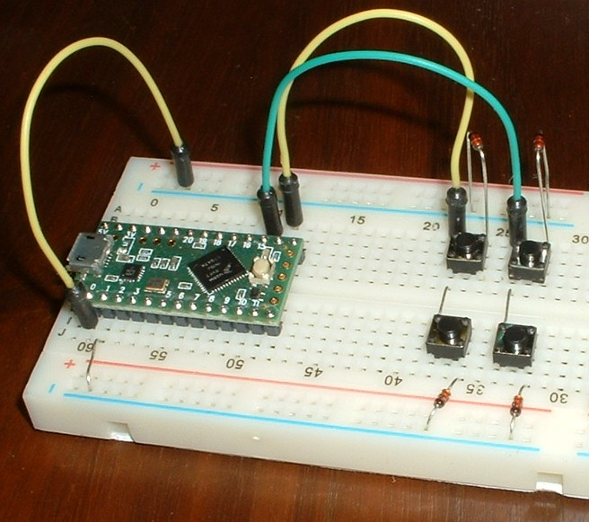

Tutorial 2 - single-layer keyboard
=======================================
The easiest way to learn the keyboard library is to read some simple sketches.
[keybrd_2_single-layer_annotated.ino](keybrd_2_single-layer_annotated/keybrd_2_single-layer_annotated.ino) is a simple sketch with annotations that explain how a keybrd sketch works.
The sketch will run on the basic breadboard keyboard described in [tutorial_1_breadboard_keyboard.md](tutorial_1_breadboard_keyboard.md)

After reading the sketch you will be able to modify it to suite your own single-layer keyboard design.

Exercises
---------
1) Read some of the class definitions used in the sketch.
The classes are defined in the [keybrd library](../src/).

2) Add a third column to the breadboard keyboard and sketch.

 
 keybrd tutorial by <a xmlns:cc="https://creativecommons.org/ns" href="https://github.com/wolfv6/keybrd" property="cc:attributionName" rel="cc:attributionURL">Wolfram Volpi</a> is licensed under a <a rel="license" href="https://creativecommons.org/licenses/by/4.0/">Creative Commons Attribution 4.0 International License</a>. Permissions beyond the scope of this license may be available at <a xmlns:cc="https://creativecommons.org/ns" href="https://github.com/wolfv6/keybrd/issues/new" rel="cc:morePermissions">https://github.com/wolfv6/keybrd/issues/new</a>.
