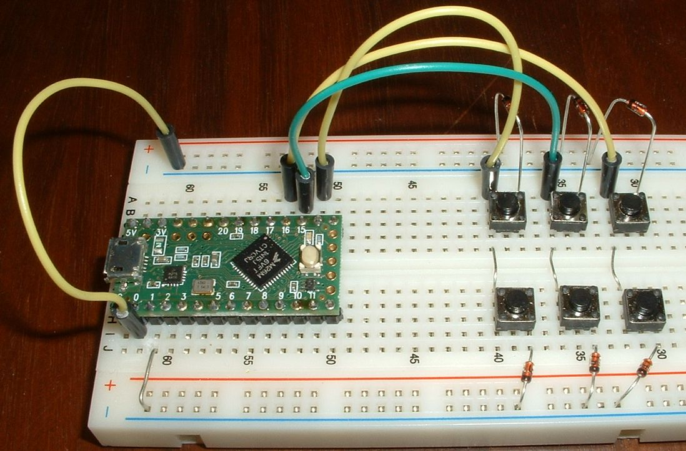

Tutorial 3cde - sublayer keyboard
=================================
This tutorial assumes you understand tutorial_3ab_multi-layer_keyboard.

When you finish this tutorial you will be able to be able to modify a multi-layer keybrd sketch.

Sublayer nomenclature
---------------------
These definitions are specific to the keybrd library.

**layer group** - is a group of layers that occupy a group of keys.

**layer subgroup** - is a layer group nested in a layer of another layer group.

Layout with a sublayer
----------------------
The next three example sketches all use this layout:

| Layout | **0** | **1** | **2** |
|:------:|:-----:|:-----:|:-----:|
|  **0** | a - 1 | b =   | c Num |
|  **1** | Alpha |  Sym  | Enter |

Each cell in the table's body represents a key.
Each element in a cell represents a scancode or layer code.

Pressing the Alpha-layer key locks the Alpha layer.
Letters 'a' 'b' 'c' are on the Alpha layer.

Pressing the Sym-layer key locks the Sym layer.
Symbols '-' '=' and 'Num' layer key are on the Sym layer.

If the keyboard is locked on the Sym layer, holding Num down makes it the active layer.
Number '1' is on the Num sublayer.
Releasing the Num key makes the locked layer active.

Sublayers are very flexible.
Example sketches 3c, 3d, and 3e implement the above layout.
Each sketch demonstrates a different layer scheme.
Which approach works best depends on the layout.

The sketches will run on the basic breadboard keyboard described in [tutorial_1_breadboard_keyboard.md](tutorial_1_breadboard_keyboard.md) with a 3rd column added to pin 16:

Sketch 3c - two layer groups
----------------------------
This layer scheme has two layer groups:

| group_1 | **0** | **1** |   **2**    |
|:-------:|:-----:|:-----:|:----------:|
|  **0**  | a - 1 | b = = | c Num null | layer group with three layers: Alpha Sym Num
|  **1**  |       |       |            |

| group_0 | **0** | **1** | **2** |
|:-------:|:-----:|:-----:|:-----:|
|  **0**  |       |       |       |
|  **1**  | Alpha |  Sym  | Enter | layer group with a one layer

group_1 covers the entire top row, therefore Num layer covers the entire top row.
Meanwhile, the layout's Num layer only covers the first key.
The unused num-layer space is filled with duplicate and null codes.
A little filler is the simplest way in some situations.

The layer scheme is implemented in keybrd_3c_sublayerNull.ino

The null is not really needed because null is on the same key as Num layer code.
And Num is the only layer code that can activate the Num layer.
The null key would be needed if another Num key where added to the layout.

The next example sketch has three layer groups that fit the layout perfectly.

Sketch 3d - three layer groups
------------------------------
This layer scheme has three layer groups:

| group_2 | **0** | **1** | **2** |
|:-------:|:-----:|:-----:|:-----:|
|  **0**  |   - 1 |       |       | layer subgroup with two layers: Sym Num
|  **1**  |       |       |       |

| group_1 |   **0**   | **1** | **2** |
|:-------:|:---------:|:-----:|:-----:|
|  **0**  | a group_2 | b =   | c Num | layer group with two layers: Alpha Sym
|  **1**  |           |       |       |

| group_0 | **0** | **1** | **2** |
|:-------:|:-----:|:-----:|:-----:|
|  **0**  |       |       |       |
|  **1**  | Alpha |  Sym  | Enter | layer group with a one layer

The three layer groups model the logic of the layout accurately, without resorting to fillers.
The layer scheme is implemented in keybrd_3d_sublayerNestedKeys.ino.

Sketch 3e - specialized layered keys
------------------------------------
Key_LayeredKeys constructor takes any number of code or key arguments.
Key_LayeredScSc is more specialized.  It's constructor takes exactly two scancode arguments.
Key_LayeredScSc has advantages when a large layer group has two layers:
* no array is created for the two scancodes, which means less clutter in the sketch
* uses less SRAM

The layer scheme is implemented in keybrd_3e_sublayerNestedScSc.ino.
It is similar to the previous sketch, but Key_LayeredKeysArray1 is replaced with Key_LayeredScSc.

Key_Layered classes include:
* Key_LayeredKeys   (any number of codes or keys)
* Key_LayeredScSc   (specialized for two scancodes)
* Key_LayeredCodeSc (specialized for one code and one scancode)

Subgroup layer-key placement
----------------------------
A subgroup's layer key(s) can be placed in one of two ways.

1) A subgroup and it's layer key(s) on the same layer.

This layout has a '1' in the Num layer and the Num layer key on the Sym layer:

| Layout | **0** | **1** | **2** |
|:------:|:-----:|:-----:|:-----:|
|  **0** | a - 1 | b =   | c Num |
|  **1** | Alpha |  Sym  | Enter |

This arrangement presents the Num layer as a "sublayer".

2) A subgroup with it's layer key(s) on single-layer key(s).

This layout has a '1' in the Num layer and the Num layer key on the bottom row:

| Layout | **0** | **1** | **2** |
|:------:|:-----:|:-----:|:-----:|
|  **0** | a - 1 | b =   | c Ent |
|  **1** | Alpha |  Sym  |  Num  |

This arrangement presents the Num layer as just another layer that happens to cover fewer keys than Alpha and Sym layers.
The top row is easily implemented in one layer group with duplicate keys filling the Num layer:

| group_1 | **0** | **1**  |   **2**   |
|:-------:|:-----:|:------:|:---------:|
|  **0**  | a - 1 | b = =  | c Ent Ent | layer group with three layers: Alpha Sym Num
|  **1**  |       |        |           |

Complex layer schemes
---------------------
The basic LayerState class used in the tutorials is sufficient for implementing many layer schemes.
More complicated layer schemes would need custom LayerState classes, and possibly custom Code_Layer and Key_Layered classes as well.
Any layer scheme can be implemented with the right custom layer classes.

[keybrd_DH](https://github.com/wolfv6/keybrd_DH) is an example of a complex layer scheme.
It emulates the DataHand keyboard, which has the most complex layout I know of.
Most layer schemes are much simpler.

Layer-scheme classes used by keybrd_DH are listed below.
Most of the layer-scheme classes are custom classes which reside in the keybrd_DH library.

DH Code_Layer classes include:
* Code_LayerLock
* Code_LayerLockMF_Protector
* Code_LayerState_Toggle

DH LayerState classes include:
* LayerState
* LayerState_DH
* LayerState_NAS

DH Key_Layered classes include:
* Key_LayeredKeys
* Key_LayeredScSc
* Key_LayeredNav
* Key_LayeredDoublePressToggle 
* Key_LayeredCodeSc_MF
* Key_LayeredOperator
* Key_LayeredNumber
* Key_LayeredNumber_00

Exercises
---------
1) Modify keybrd_3e_sublayerNestedScSc.ino to match the following layout
  (add the number '2' to the Num layer):

| Layout | **0** | **1** | **2** |
|:------:|:-----:|:-----:|:-----:|
|  **0** | a - 1 | b = 2 | c Num |
|  **1** | Alpha |  Sym  | Enter |

2) Modify keybrd_3c_sublayerNull.ino to match the following layout
   (this was described above in "Subgroup layer-key placement"):

| Layout | **0** | **1** | **2** |
|:------:|:-----:|:-----:|:-----:|
|  **0** | a - 1 | b =   | c Ent |
|  **1** | Alpha |  Sym  |  Num  |

