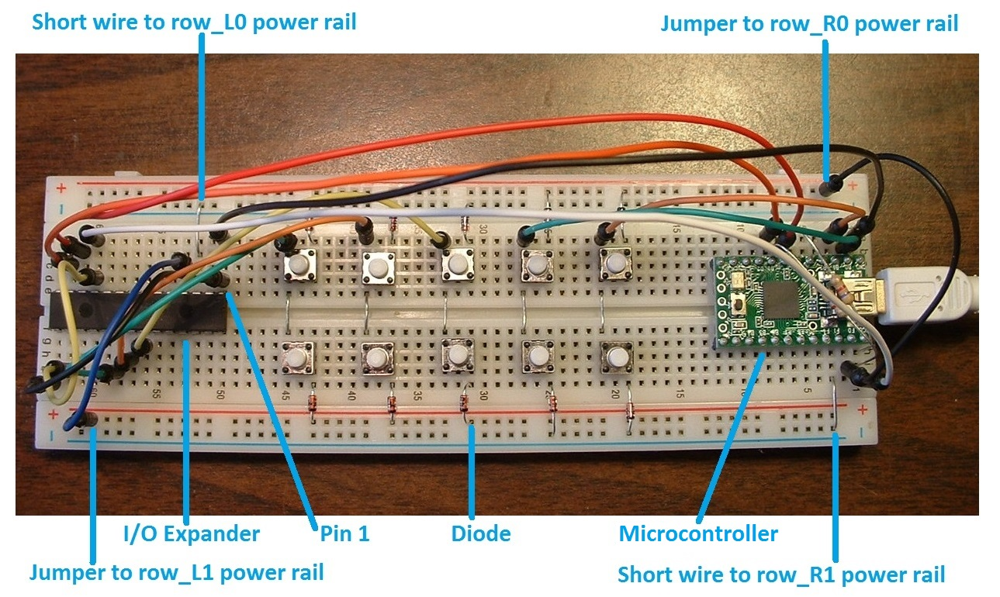

keybrd Tutorial 4 - split keyboard with I/O Expander
====================================================
When you finish this tutorial you will be able to be able to modify a 2-matrix keybrd sketch to suite your own split keyboard design.

## Overview of split keyboard with I/O Expander
The breadboard in this picture models a split keyboard.

The right matrix is connected to a microcontroller.
The left matrix is connected to a I/O expander.

There is a total of 4 matrix rows, each on a dedicated power rail.

The microcontroller and I/O expander communicate by [I2C](http://en.wikipedia.org/wiki/I%C2%B2C) via 4 jumper wires:
* ground
* power
* Serial CLock input (SCL)
* Serial DAta I/O (SDA)

The two resistors near the microcontroller pull-up voltage on the SCL and SDA pins.

The I/O expander has a small notch on one end, which identifies the end with pin 1.
In the picture, pin 1 is on the right end.

## Building a split keyboard with I/O Expander
The split keyboard is built on the Basic Breadboard Keyboard described in
tutorial_0_keybrd_breadboard.md > Building a Basic Breadboard Keyboard

Follow these instructions to add a second matrix to the Basic Breadboard Keyboard:
4. Insert I2C jumper wires and pull-up resistors connecting to Teensy2.
 * follow the I2C and pull-up resistors tables (below) and consult Teensy pinout diagram in
   [Connecting Teensy 2.0 to a Keyboard](connecting_teensy2_to_keyboard.md)

todo these tables might not match the sketch

**Teensy 2.0 pin connections tables**

| Pin Number | Row  Column |
|------------|-------------|
| 21         | row_R0      |
| 20         | row_R1      |
| 0          | col_R0      |
| 1          | col_R1      |

| Pin Number | I2C         |
|------------|-------------|
| GND        | ground      |
| VCC        | power       |
| 5          | SCL         |
| 6          | SDA         |

| Pin Number | 4.7K Ohms Pull-up Resistor |
|------------|-------------|
| 5          | VCC         |
| 6          | VCC         |

5. Insert jumper wires to connect MCP23018 I/O expander
 * follow pin connections tables (below) and consult pinout diagram in
   [Connecting MCP23018 I/O Expander to a Keyboard](connecting_MCP23018_to_keyboard.md)

**MCP23018 I/O expander pin connections tables**

| Pin Number | Row  Column |
|------------|-------------|
| 3          | row_L0      |
| 4          | row_L1      |
| 20         | col_L0      |
| 21         | col_L1      |
| 22         | col_L2      |

| Pin Number | I2C         |
|------------|-------------|
| 1          | ground      |
| 11         | power       |
| 12         | SCL         |
| 13         | SDA         |

| Pin Number | Jump to Pin |
|------------|-------------|
| 11         | 16          |
| 1          | 15          |

todo add capacitor

## Sketch for split keyboard with I/O Expander
The [keybrd_4_split_with_IOE_annotated.ino](keybrd_4_split_with_IOE_annotated/keybrd_4_split_with_IOE_annotated.ino)
 sketch explains how the I/O Expander works on a keyboard.
