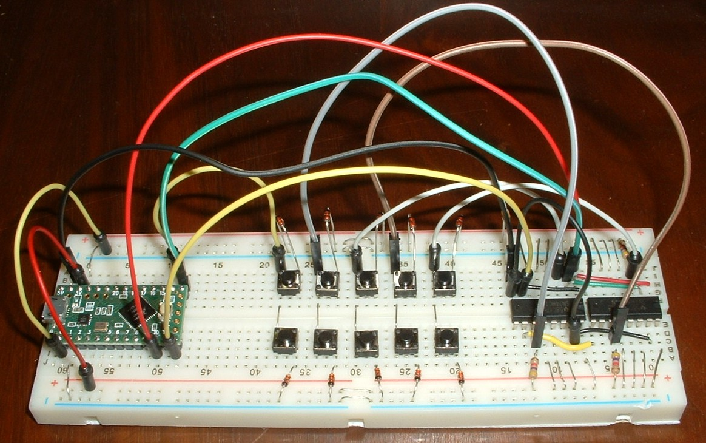
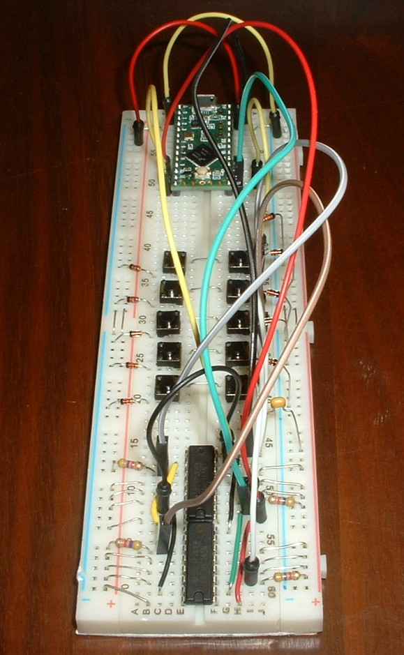
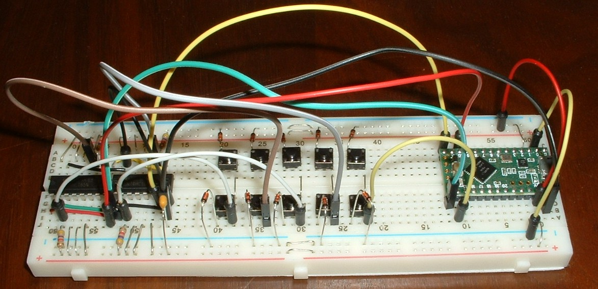

keybrd Tutorial 4b - split keyboard with shift registers
========================================================
When you finish this tutorial you will be able to be able to modify a 2-matrix keybrd sketch to suite your own split keyboard design.

## Overview of split keyboard with shift registers
The breadboard in the following picture models a split keyboard.

The primary matrix on the left has one column, which is read by a microcontroller pin.
The secondary matrix on the right has 4 columns, which are read by the shift register input pins.
The primary and secondary matrices share the same rows, which are strobed by micro-controller pins.
Both matrices are active low.



## Building a split keyboard with shift registers
The breadboard keyboard modifies the basic breadboard keyboard described in [tutorial_1_breadboard_keyboard.md](tutorial_1_breadboard_keyboard.md)

Add components to the breadboard as shown in the picture.

The shift register is a SN74HC165N.  Details are in the SN74HC165N datasheet.

Each shift register has a small notch on one end to identify pin 1.
In the picture, 1 pins are on the right end.
Shift registers are chained together by colored wires that lay flat on the breadboard.

Each shift register has 8 parallel input pins, 4 on each side.
The breadboard doesn't have enough room for 16 columns; only 4 columns are connected to the shift registers.
Every 4th input pin is connected to a matrix column and a pull-up resistor.
Unused input pins are connected to power.
The red bus strips power the pull up resistors and unused input pins.

A decoupling capacitor between the power and ground wires dampens noise coming in through those wires.





Blue bus strips are used for strobing rows

I apologize for not having a schematic.  This table should help you figure out the pictures:

<!-- todo add schematic -->

```
74HC165 left (upper half of breadboard)
NAME    PIN# I/O DESCRIPTION         DESTINATION     PIN#   CHAIN (wires flat on breadboard)
SH/LD   1    I   shift or load input Teensy LC CS0   10     red wire
CLK     2    I   clock input         Teensy LC SCK0  13     green wire
 D4     3    I   parallel input      pull-up resistor       red bus
 D5     4    I   parallel input      power                  red bus
 D6     5    I   parallel input      power                  red bus
 D7     6    I   parallel input      power                  red bus
/QH     7    O   ~serial output      Teensy LC MISO0 12
GND     8        ground              gnd                    black wire

74HC165 right (lower half of breadboard)
NAME    PIN# I/O DESCRIPTION         DESTINATION            CHAIN (wires flat on breadboard)
VCC     16       power pin           Teensy LC 3.3V         red bus
CLK INH 15   I   clock inhibit       gnd                    black wire
 D3     14   I   parallel input      power                  red bus
 D2     13   I   parallel input      power                  red bus
 D1     12   I   parallel input      power                  red bus
 D0     11   I   parallel input      pull-up resistor       red bus
SER     10   I   serial input        next QH                yellow wire
 QH      9   O   serial output       previous SER           yellow wire

```
## Sketch for split keyboard with shift registers
[keybrd_4b_split_keyboard_with_shift_registers.ino](keybrd_4b_split_keyboard_with_shift_registers/keybrd_4b_split_keyboard_with_shift_registers.ino) is a simple sketch with two shift registers.
The sketch will run on the above breadboard keyboard.
Annotations in the sketch explain the code.

## Exercises
1. Guess what happens if an unused input pin is not powered?  Try it.

<br><br>
<a rel="license" href="http://creativecommons.org/licenses/by/4.0/"></a><br /><span xmlns:dct="http://purl.org/dc/terms/" property="dct:title">keybrd tutorial</span> by <a xmlns:cc="http://creativecommons.org/ns#" href="https://github.com/wolfv6/keybrd" property="cc:attributionName" rel="cc:attributionURL">Wolfram Volpi</a> is licensed under a <a rel="license" href="http://creativecommons.org/licenses/by/4.0/">Creative Commons Attribution 4.0 International License</a>.<br />Permissions beyond the scope of this license may be available at <a xmlns:cc="http://creativecommons.org/ns#" href="https://github.com/wolfv6/keybrd/issues/new" rel="cc:morePermissions">https://github.com/wolfv6/keybrd/issues/new</a>.
