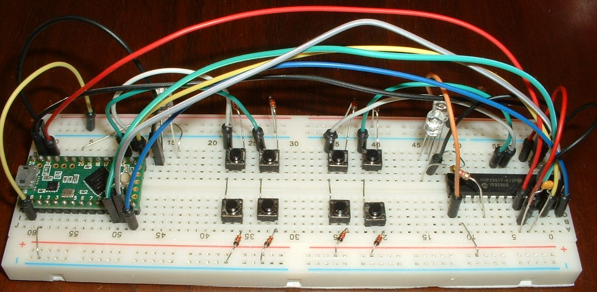
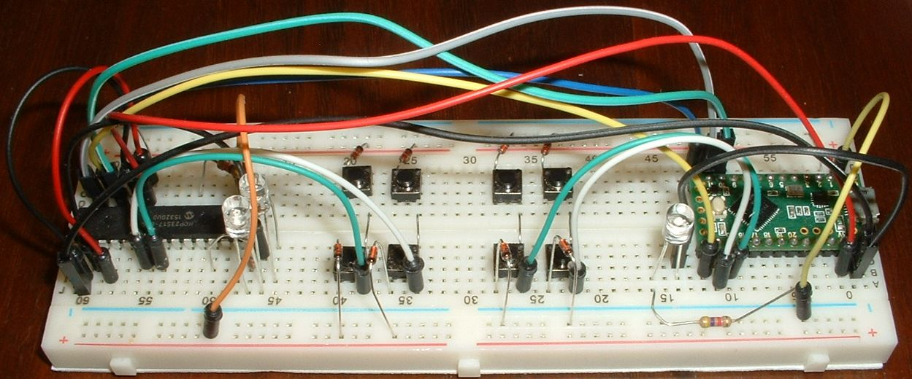
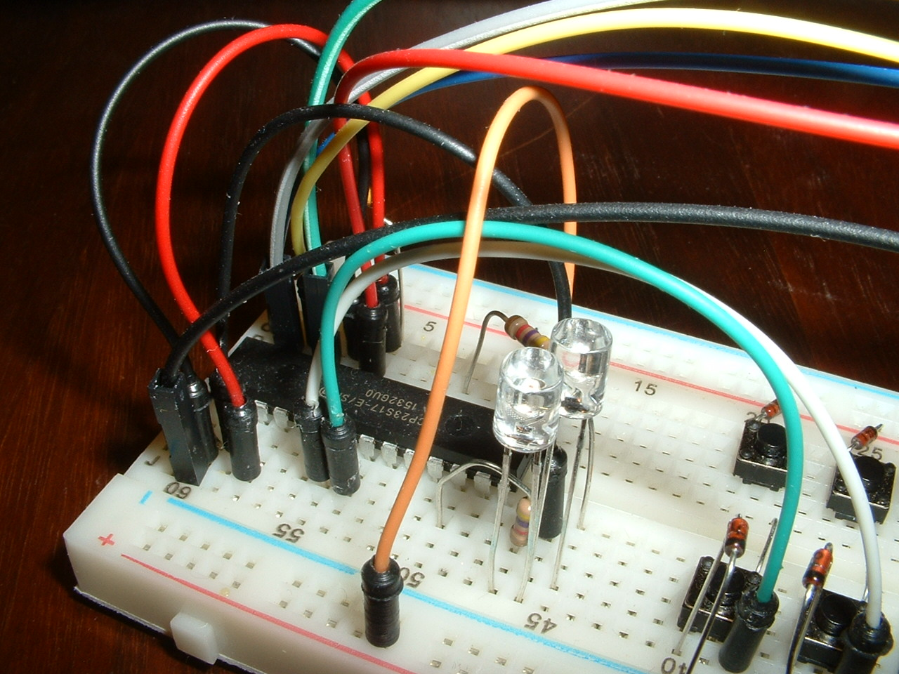

Tutorial 5b - indicator LED on IOE
==================================
This tutorial will show you how to add LEDs to an I/O expander.

It is assumed the reader is familiar with LEDs from tutorial_5a_LED_on_uC.md
and familiar with I/O expanders from tutorial_4c_split_keyboard_with_IOE.md.

Adding LEDs to the basic breadboard keyboard
--------------------------------------------
The breadboard keyboard modifies the split breadboard keyboard described in [tutorial_4c_split_keyboard_with_IOE.md](tutorial_4c_split_keyboard_with_IOE.md)

Add components to the breadboard as shown in the picture.

The two clear plastic cylinders are red and yellow LEDs.
Each LED is in series with a 4.7k Ohm current limiting resistor.
LED anodes (the longer lead) are powered by pins GPA5 and GPB4.
LED cathodes (the shorter lead) are connected to a grounded terminal strip.

keybrd sketch with LEDs on IOE
------------------------------
The [keybrd_5b_LED_on_IOE.ino](keybrd_5b_LED_on_IOE/keybrd_5b_LED_on_IOE.ino) sketch will run on the above breadboard keyboard.

The sketch demonstrates:
* multiple layers
* split keyboard
* LED on controller
* LED on IOE write port
* LED on IOE read port
