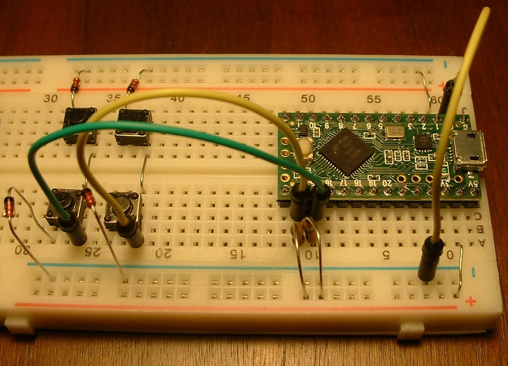

Tutorial 6 - Active high
=========================
This tutorial pulls together several concepts needed to understand active state in the context of a keyboard.
Skip to the end of this tutorial if you just want to copy an active-high keyboard.

Pull-up resistors
-----------------
There are many sources that explain "pull-up resistors", so I won't repeat it here.
Here is a [good tutorial on Pull-up Resistors](https://learn.sparkfun.com/tutorials/pull-up-resistors/what-is-a-pull-up-resistor).

Active low
----------
All the keyboards up to this point in the tutorial series have used active low with internal pull-up resistors.

"Active low" means that if a switch is pressed (active state), the read pin is low.
When the switch is released (inactive state), the pull-up resistor pulls the read pin high.

The following table traces the strobe current from left to right (0 is ground, 1 is power).
If the switch is closed, the strobe current passes through the switch and pulls the read pin low.
If the switch is open, the pull-up resistor pulls the read pin high.
<br>

|Strobe pin on |  Diode orientation | Switch position | Pull resistor |  Read pin state |
|:------------:|:------------------:|:---------------:|:-------------:|:---------------:|
|       0      | cathode -:<- anode |     close       | 1  pull-up    | 0    active low |
|       0      | cathode -:<- anode |      open       | 1  pull-up    | 1 inactive high |
<br>
Arduino boards have internal pull-up resistors, which saves on parts and labor compared to manually adding external pull resistors.

To make a keyboard active low:
* Orient diodes with cathode (banded end) towards the write pins (row)
* Define strobe on and strobe off in the sketch like this:
```
    const bool Scanner_uC::STROBE_ON = LOW;
    const bool Scanner_uC::STROBE_OFF = HIGH;
```

Active high
-----------
"Active high" means that if a switch is pressed (active), the read pin is high.
When the switch is released (inactive), the pull-down resistor pulls the read pin low.

The following table traces the strobe current from left to right (0 is ground, 1 is power).
If the switch is closed, the strobe current passes through the switch and pulls the read pin high.
If the switch is open, the pull-down resistor pulls the read pin low.
<br>

|Strobe pin on |  Diode orientation | Switch position | Pull resistor |  Read pin state |
|:------------:|:------------------:|:---------------:|:-------------:|:---------------:|
|       1      | anode ->:- cathode |     close       |  0  pull-down | 1   active high |
|       1      | anode ->:- cathode |      open       |  0  pull-down | 0  inactive low |
<br>
Arduino boards do not have internal pull-down resistors.
If you want to use active low, you will have to add external pull-down resistors to the read pins.

To make a keyboard active high:
* Add an external 10k pull-down resistor to each read pin
* Orient diodes with cathode (banded end) towards the read pins
* Define strobe on and off in the sketch like this:
```
    const bool Scanner_uC::STROBE_ON = HIGH;
    const bool Scanner_uC::STROBE_OFF = LOW;
```

Making a breadboard keyboard active-high
----------------------------------------
This tutorial converts the basic breadboard keyboard from tutorial 1 to active high.
By comparing the above tables, one can see what changes need to be made:
* add external pull-down resistors to the read pins
* flip the diodes so that the cathode (banded end) are towards the read pins
* swap the STROBE_ON and STROBE_OFF values

The red bus is grounded.
The pull-down resistors plug into the red bus and column read pins.

The [keybrd_6_active_highsketch.ino](keybrd_6_active_high/keybrd_6_active_high.ino) is the tutorial 1 sketch with STROBE_ON and STROBE_OFF values swapped.



<br>
<a rel="license" href="http://creativecommons.org/licenses/by/4.0/"></a><br /><span xmlns:dct="http://purl.org/dc/terms/" property="dct:title">keybrd tutorial</span> by <a xmlns:cc="http://creativecommons.org/ns#" href="https://github.com/wolfv6/keybrd" property="cc:attributionName" rel="cc:attributionURL">Wolfram Volpi</a> is licensed under a <a rel="license" href="http://creativecommons.org/licenses/by/4.0/">Creative Commons Attribution 4.0 International License</a>.<br />Permissions beyond the scope of this license may be available at <a xmlns:cc="http://creativecommons.org/ns#" href="https://github.com/wolfv6/keybrd/issues/new" rel="cc:morePermissions">https://github.com/wolfv6/keybrd/issues/new</a>.
